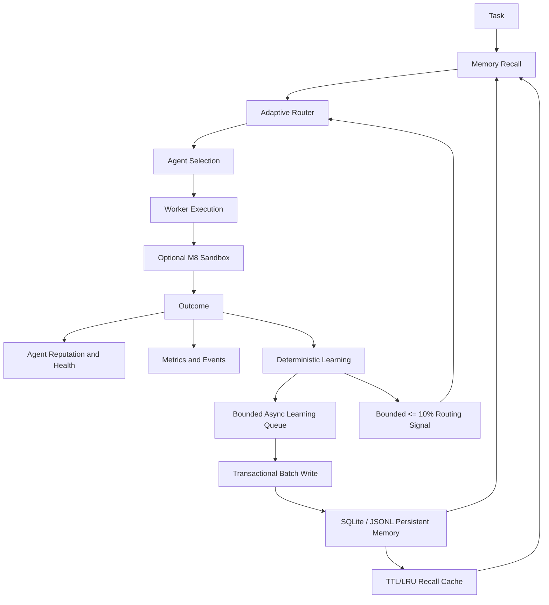

# Helix Architecture

Helix is an independently implemented durable multi-agent orchestration runtime. Its architecture separates planning, routing, execution, policy enforcement, persistence, observability, and learning so that memory can improve future routing without becoming an authority over security or capability constraints.

## Execution and learning loop

## Core boundaries

The planner creates a validated task DAG. The scheduler manages leases and restart recovery. The registry owns current agent health and reputation. The router combines capability, availability, health, reputation, cost, latency, exploration, and an optional bounded learning bonus. When a fully compatible candidate exists, incompatible candidates are excluded before scoring. A learned memory signal therefore cannot override a required capability mismatch.

The policy engine remains default-deny and governs tool, plugin, MCP, and approval boundaries. The M8 sandbox is optional and preserves the existing runtime behavior when disabled. Local execution uses explicit argv, path validation, environment filtering, timeout, and process-group cleanup. Docker execution adds read-only root, non-root execution, dropped capabilities, no-new-privileges, resource limits, workspace-only writable storage, and network disabled by default.

## Persistent memory

`MemoryBackend` is the stable persistence abstraction. M9 `MemoryStore` remains a local-first durable JSONL implementation that preserves the previous `MemoryRecord` API. M10 adds `SqliteMemoryStore`, using `better-sqlite3`, WAL mode, transactional batch writes, normalized namespace/agent/swarm/task/type/tag/timestamp/confidence indexes, FTS5 lexical candidate retrieval, bounded result limits, JSONL migration, and deterministic compaction. The runtime defaults to SQLite; JSONL remains an explicit compatibility backend. Remote PostgreSQL, pgvector, Qdrant, Chroma, and Neo4j adapters remain future extension points.

Hybrid search is transparent and configurable. SQLite first narrows candidates through indexed filters and FTS5, then combines keyword matching, a deterministic local embedding abstraction, recency decay, namespace relevance, confidence, and provenance. A bounded TTL/LRU `MemoryCache` avoids repeated reads and is invalidated on mutation. The deterministic embedding provider is a stable test/local adapter and makes no claim to be a production semantic model.

## Access and provenance

Namespaces are `global`, `agent:<agentId>`, `swarm:<swarmId>`, `task:<taskId>`, and `session:<sessionId>`. Reads are filtered through subject, owner, visibility, swarm membership, task ownership, and explicit privileged context. Every learned entry has source type, source identifier, timestamp, confidence, and relevant task/execution/agent/swarm identifiers.

Memory is untrusted data. Helix never executes memory contents as code or blindly follows instructions stored in memory. Outcome and sandbox persistence passes through a secret-safe sanitization layer, and duplicate outcome keys prevent replayed learning events from multiplying evidence.

## Learning integration

`PersistentLearningEngine` records successful solutions, routing hints, private agent experience, and failed patterns. It exposes recall, routing hints, execution hints, agent experience, success/failure recording, and bounded routing scores. Failure signals require a configurable repeated-failure threshold and confidence threshold before a temporary negative preference is returned. Runtime outcomes are queued asynchronously by default, deduplicated by replay key, and drained in bounded batches; `flushLearning()` provides an explicit durability barrier. Half-life decay changes influence over time without deleting memories.

## External surfaces

The versioned API exposes memory CRUD/search/compact and learning hint, experience, outcome, and flush endpoints. The CLI exposes memory search/list/inspect/stats/compact and learning agent/hints/flush commands. The MCP package registers governed memory and learning tools with explicit schemas and `memory:read` permission. Existing API, CLI, provider, plugin, RBAC, federation, knowledge graph, workflow, swarm, and sandbox surfaces remain available.

See [`docs/milestone-9-memory-learning.md`](docs/milestone-9-memory-learning.md) and [`docs/milestone-10-production-memory.md`](docs/milestone-10-production-memory.md) for design, security review, benchmark method, and limitations. See [`docs/architecture.mmd`](docs/architecture.mmd) for the full Mermaid system diagram.

## M11 MCP ecosystem

The M11 MCP server is an adapter boundary above the existing runtime. `McpCapabilityBridge` delegates to `HelixRuntime`, `AgentRegistry`, `LeaseScheduler`, `SqliteMemoryStore`, `PersistentLearningEngine`, `SandboxManager`, `PolicyEngine`, `WorkflowEngine`, `EvaluationEngine`, `ProviderRegistry`, telemetry, and the durable event store. It does not replace those components or create a second scheduler or worker implementation.

`McpToolRegistry` stores 176 unique definitions across 20 families. Each definition includes a typed Zod input schema, family, risk classification, permissions, and deterministic handler. The registry applies actor, family, and tool rate limits before dispatch and records bounded sanitized audit events. Errors are normalized into typed categories and do not expose stack traces, secrets, or raw paths.

The official MCP SDK adapter registers the tool definitions with `McpServer`, eight protected `helix://` resources, and six reusable prompts. `helix mcp serve` uses the official `StdioServerTransport`; `pnpm mcp:serve:http` uses the official `StreamableHTTPServerTransport` on loopback by default. GitHub and browser families are explicit connector boundaries in this local build, and federation send is denied by default.

Authorization is layered. MCP risk checks are applied first, then existing Helix memory ACLs, runtime policy, and sandbox validation remain authoritative. A viewer can read permitted data but cannot mutate memory, spawn agents, execute sandbox commands, approve policy, or send remote federation messages. MCP cannot bypass capability matching, default-deny policy, or M8 sandbox controls.

See [`docs/milestone-11-mcp.md`](docs/milestone-11-mcp.md) for the complete family inventory, transport configuration, benchmark, security review, Claude Code setup, and limitations.
