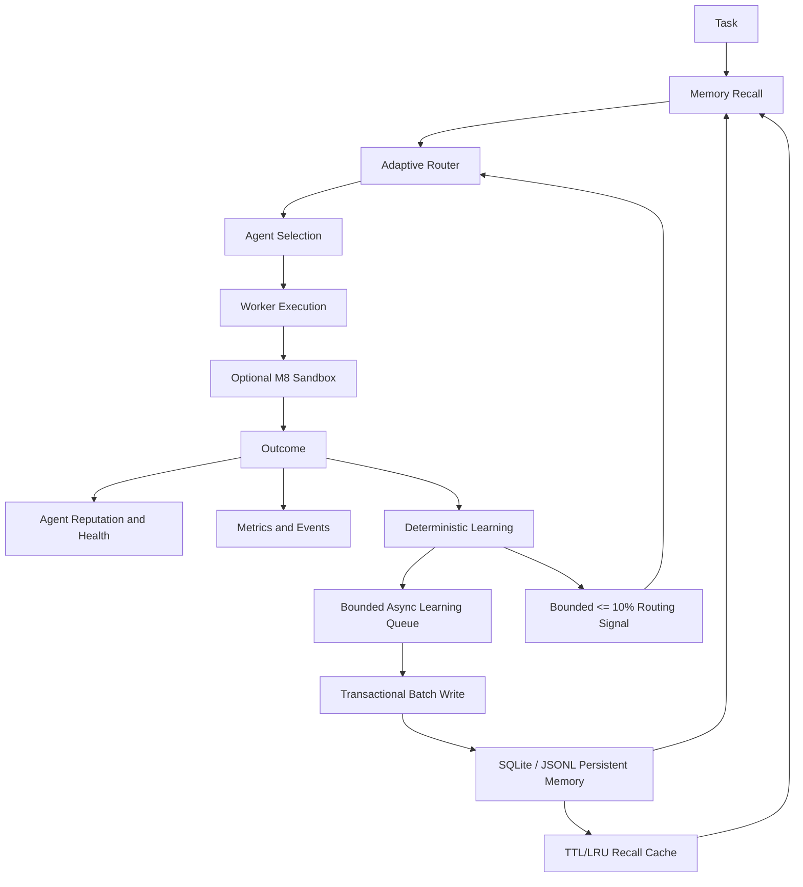

# Helix Architecture

Helix is an independently implemented durable multi-agent orchestration runtime. Its architecture separates planning, routing, execution, policy enforcement, persistence, observability, and learning so that memory can improve future routing without becoming an authority over security or capability constraints.

## Execution and learning loop



## Core boundaries

The planner creates a validated task DAG. The scheduler manages leases and restart recovery. The registry owns current agent health and reputation. The router combines capability, availability, health, reputation, cost, latency, exploration, and an optional bounded learning bonus. When a fully compatible candidate exists, incompatible candidates are excluded before scoring. A learned memory signal therefore cannot override a required capability mismatch.

The policy engine remains default-deny and governs tool, plugin, MCP, and approval boundaries. The M8 sandbox is optional and preserves the existing runtime behavior when disabled. Local execution uses explicit argv, path validation, environment filtering, timeout, and process-group cleanup. Docker execution adds read-only root, non-root execution, dropped capabilities, no-new-privileges, resource limits, workspace-only writable storage, and network disabled by default.

## Persistent memory

`MemoryBackend` is the stable persistence abstraction. M9 `MemoryStore` remains a local-first durable JSONL implementation that preserves the previous `MemoryRecord` API. M10 adds `SqliteMemoryStore`, using `better-sqlite3`, WAL mode, transactional batch writes, normalized namespace/agent/swarm/task/type/tag/timestamp/confidence indexes, FTS5 lexical candidate retrieval, bounded result limits, JSONL migration, and deterministic compaction. The runtime defaults to SQLite; JSONL remains an explicit compatibility backend. Remote PostgreSQL, pgvector, Qdrant, Chroma, and Neo4j adapters remain future extension points.

Hybrid search is transparent and configurable. SQLite first narrows candidates through indexed filters and FTS5, then combines keyword matching, a deterministic local embedding abstraction, recency decay, namespace relevance, confidence, and provenance. A bounded TTL/LRU `MemoryCache` avoids repeated reads and is invalidated on mutation. The deterministic embedding provider is a stable test/local adapter and makes no claim to be a production semantic model.

## Access and provenance

Namespaces are `global`, `agent:<agentId>`, `swarm:<swarmId>`, `task:<taskId>`, and `session:<sessionId>`. Reads are filtered through subject, owner, visibility, swarm membership, task ownership, and explicit privileged context. Every learned entry has source type, source identifier, timestamp, confidence, and relevant task/execution/agent/swarm identifiers.

Memory is untrusted data. Helix never executes memory contents as code or blindly follows instructions stored in memory. Outcome and sandbox persistence passes through a secret-safe sanitization layer, and duplicate outcome keys prevent replayed learning events from multiplying evidence.

## Learning integration

`PersistentLearningEngine` records successful solutions, routing hints, private agent experience, and failed patterns. It exposes recall, routing hints, execution hints, agent experience, success/failure recording, and bounded routing scores. Failure signals require a configurable repeated-failure threshold and confidence threshold before a temporary negative preference is returned. Runtime outcomes are queued asynchronously by default, deduplicated by replay key, and drained in bounded batches; `flushLearning()` provides an explicit durability barrier. Half-life decay changes influence over time without deleting memories.

## External surfaces

The versioned API exposes memory CRUD/search/compact and learning hint, experience, outcome, and flush endpoints. The CLI exposes memory search/list/inspect/stats/compact and learning agent/hints/flush commands. The MCP package registers governed memory and learning tools with explicit schemas and `memory:read` permission. Existing API, CLI, provider, plugin, RBAC, federation, knowledge graph, workflow, swarm, and sandbox surfaces remain available.

See [`docs/milestone-9-memory-learning.md`](docs/milestone-9-memory-learning.md) and [`docs/milestone-10-production-memory.md`](docs/milestone-10-production-memory.md) for design, security review, benchmark method, and limitations. See [`docs/architecture.mmd`](docs/architecture.mmd) for the full Mermaid system diagram.

## M11 MCP ecosystem

The M11 MCP server is an adapter boundary above the existing runtime. `McpCapabilityBridge` delegates to `HelixRuntime`, `AgentRegistry`, `LeaseScheduler`, `SqliteMemoryStore`, `PersistentLearningEngine`, `SandboxManager`, `PolicyEngine`, `WorkflowEngine`, `EvaluationEngine`, `ProviderRegistry`, telemetry, and the durable event store. It does not replace those components or create a second scheduler or worker implementation.

`McpToolRegistry` stores 215 unique definitions across 21 families. Each definition includes a typed Zod input schema, family, risk classification, permissions, and deterministic handler. The registry applies actor, family, and tool rate limits before dispatch and records bounded sanitized audit events. Errors are normalized into typed categories and do not expose stack traces, secrets, or raw paths.

The official MCP SDK adapter registers the tool definitions with `McpServer`, sixteen protected `helix://` resources, and twelve reusable prompts. `helix mcp serve` uses the official `StdioServerTransport`; `pnpm mcp:serve:http` uses the official `StreamableHTTPServerTransport` on loopback by default. GitHub and browser families are explicit connector boundaries in this local build. Federation task dispatch is default-deny for untrusted actors and requires explicit remote authorization; arbitrary federation send remains denied.

Authorization is layered. MCP risk checks are applied first, then existing Helix memory ACLs, runtime policy, and sandbox validation remain authoritative. A viewer can read permitted data but cannot mutate memory, spawn agents, execute sandbox commands, approve policy, or send remote federation messages. MCP cannot bypass capability matching, default-deny policy, or M8 sandbox controls.

See [`docs/milestone-11-mcp.md`](docs/milestone-11-mcp.md) for the M11 family inventory, transport configuration, benchmark, security review, Claude Code setup, and limitations.

## M12 autonomous intelligence

M12 adds `packages/intelligence` as a coordination layer above the existing runtime. It creates and analyzes typed goals, decomposes them into bounded category-aware steps, validates dependencies/capabilities/topology/security constraints, selects compatible agents through the existing router, forms a topology-aware swarm team, delegates execution to the existing scheduler and worker path, evaluates observable evidence, and performs bounded replanning. The layer is deterministic by default and does not invent LLM outputs or metrics.

The orchestration state machine is durable and guarded: `CREATED → ANALYZING → PLANNING → VALIDATING → READY → RUNNING → EVALUATING`, with bounded `REPLANNING` returning to `RUNNING`, and terminal `COMPLETED`, `FAILED`, or `CANCELLED` states. Every step records attempts, selected agent, timestamps, output metadata, errors, and timeout classification. Restart recovery rehydrates the goal, plan, orchestration record, and durable events.

M12 reuses M10 SQLite memory and `PersistentLearningEngine` for advisory recall and sanitized post-execution learning. Memory cannot override hard capability mismatches, policy decisions, approval gates, or sandbox validation. High- and critical-risk plans require explicit authorization. `maxReplans`, `maxRetriesPerStep`, `maxIterations`, task count, depth, and fan-out remain bounded.

The runtime exposes `createOrchestrator()`. CLI, API, and M11 MCP surfaces expose goal, plan, execution, evaluation, cancellation, status, metrics, and explainability operations. M12 adds fourteen typed MCP tools, three resources, and four prompts while preserving the existing authorization, rate-limiting, and audit pipeline. See [`docs/milestone-12-intelligence.md`](docs/milestone-12-intelligence.md) and [`docs/architecture.mmd`](docs/architecture.mmd) for the detailed design and flow.

## M13 autonomous swarm

M13 adds a dynamic swarm control plane in `packages/swarm` and extends the M12 orchestrator rather than replacing it. `DynamicSwarmManager` owns bounded swarm membership, multi-role assignments, coordinator promotion/demotion, adaptive topology, capability-safe delegation, loop-protected handoffs, collaboration graph evidence, autoscaling, health monitoring, deterministic rebalancing, application-level consensus, result aggregation, and M10 SQLite learning observations.

The swarm manager delegates actual work to the existing `LeaseScheduler`; it does not create a second scheduler, worker pool, load manager, AgentRegistry, router, memory backend, sandbox, or policy engine. Formation describes assignments without consuming execution leases. Concrete delegation acquires a scheduler lease and completion releases it. Capability mismatch is checked before any reputation, health, specialization, historical, or learning score. High- and critical-risk swarms require explicit authorization.

The swarm state machine is `CREATED → FORMING → READY → RUNNING → REBALANCING → COMPLETING → COMPLETED`, with guarded `PAUSED`, `FAILED`, and `CANCELLED` paths. Handoffs, fan-out, scaling, rebalancing, and recovery are bounded. Health events include unhealthy and overloaded agents, stalled tasks, rebalancing, topology changes, and scale changes. The collaboration graph is in-memory with durable event evidence and exposes neighbors, history, task flow, and critical path without requiring a graph database.

Topology rules are explicit: high parallelism favors `parallel` or `mesh`, dependency density favors `pipeline`, high risk or failure favors `hierarchical` with security review, and low load permits role collapse and scale-down. Majority, unanimous, and weighted review use only eligible capable voters and are explicitly application-level rather than Byzantine fault tolerant. Missing task results are never fabricated.

The runtime exposes `runtime.swarms` and M12 orchestrator wrappers. M13 adds versioned `/api/v1/swarms` routes, CLI `helix swarm` commands, fourteen dynamic swarm MCP controls plus two lifecycle/topology controls, and protected swarm/collaboration resources. These remain under the existing authorization, rate-limiting, audit, memory ACL/provenance/sanitization, scheduler, policy, and sandbox boundaries. See [`docs/milestone-13-autonomous-swarm.md`](docs/milestone-13-autonomous-swarm.md) and [`docs/architecture.mmd`](docs/architecture.mmd).

## M14 distributed orchestration and federation

M14 adds a distributed federation adapter in `packages/federation` and injects it into `HelixRuntime` as `runtime.federation`. `NodeRegistry` owns node identity, endpoint, role, capability, trust, health, heartbeat, and explicit lifecycle state. `FederationRouter` ranks only healthy capability-compatible nodes and keeps local/remote locality and trust visible in its decision rationale. `FederationCoordinator` owns message dispatch, node-aware task records, remote completion evidence, federated swarm membership, reassignment, rebalancing, aggregate results, and federation metrics; it does not replace the existing scheduler, workers, router, memory backend, sandbox, or policy engine.

Federation messages are versioned and signed through injectable `MessageSigner` and `MessageVerifier` implementations. The built-in HMAC implementation is deterministic for local operation and tests; production deployments must inject a managed key or asymmetric trust provider. Messages preserve source and destination node identity, correlation ID, trace ID, authorization context, capabilities, priority, nonce, timestamp, TTL, and schema version. Timestamp skew, expiry, invalid signatures, unknown schema versions, and replayed message IDs are rejected before handler effects.

`DistributedLeaseManager` uses a replaceable lease store and monotonic fencing tokens. Acquisition is exclusive by task, renewal requires the current token, expiry is explicit, and stale completion is rejected. `FileLeaseStore` provides a durable local option; it is not a distributed consensus mechanism. `InMemoryFederationTransport` is a deterministic transport adapter for local testing. Remote task handling is explicit and default-deny: the security context must contain `federation:dispatch` and a non-`UNTRUSTED` trust level, and remote nodes do not inherit local privileges.

The M14 control flow is:

```text
Node registration → health/heartbeat → capability-safe routing → signed task.submit
→ remote coordinator lease → existing worker execution seam → signed accept/completion
→ source correlation/fencing validation → durable evidence → bounded recovery/reassignment
```

The API exposes federation node, status, heartbeat, drain, removal, metrics, lease, dispatch, and task-status routes. The CLI exposes `helix federation doctor|nodes|node|status|metrics|dispatch|leases`. The governed MCP registry adds federation node, heartbeat, dispatch, task-status, lease, metrics, message-verification, and trust-inspection actions, together with federation resources and recovery/security prompts. All remain behind the existing MCP actor authorization, risk classification, rate limiting, sanitized audit, and error normalization layers.

The current M14 implementation intentionally leaves distributed graph/snapshot persistence, multi-host transport deployment, shared lease/outbox authority, quorum or Byzantine consensus, TLS and secret-manager integration, production worker execution adapters, chaos testing, and independent security review as release gates. See [`docs/milestone-14-federation.md`](docs/milestone-14-federation.md) and [`docs/architecture.mmd`](docs/architecture.mmd).

## M15 production distributed execution

M15 separates federation **control plane** concerns from the existing Helix **execution plane**. The control plane owns authenticated node-to-node envelopes, capability and trust checks, correlation/trace identifiers, idempotency, durable local outbox/inbox state, leases, fencing tokens, retry/dead-letter state, cancellation, node drain, and bounded reassignment. The execution plane remains `HelixRuntime`: a received task enters `executeFederatedTask()` and then the canonical `runExecution()` → `runTask()` path, using the existing router, agent registry, scheduler, worker/provider, sandbox, policy, event, telemetry, memory, and learning components.

A remote submit is therefore not a fake completion callback. The destination `FederationNodeRuntime` installs a task handler, acquires the destination federation lease, adapts the payload to a single-task runtime input, propagates an abort signal and sandbox request, waits for the existing worker path, records sanitized federated learning with source-node provenance, and sends signed completion, failure, cancellation, or timeout evidence. The source validates correlation, attempt ID, and fencing token before changing its task record.

M15 adds `SqliteOutboxStore` and `SqliteInboxStore` as durable local infrastructure. Outbox rows support idempotent enqueue, claim, restart recovery of `sending`, retry, acknowledgement, and dead-letter inspection. Inbox rows suppress duplicate effects by message ID or idempotency key. These stores are not a replicated log or distributed consensus mechanism; production deployment needs a reviewed shared delivery and task-state authority.

Peer authentication is key-ID-aware. HMAC-SHA256 is the explicit development/test implementation, while `KeyProvider`, `KeyProviderMessageSigner`, and `KeyProviderMessageVerifier` leave a seam for Ed25519, mTLS, KMS, or managed peer identities. The rotating provider accepts the active key and two bounded previous keys. Envelope verification rejects unsupported algorithms, unknown key IDs, invalid signatures, replay, excessive clock skew, and expired messages before handler effects. Remote dispatch requires `federation:dispatch` plus `TRUSTED` or `ADMIN`; `LIMITED` and `UNTRUSTED` contexts cannot dispatch remotely.

`HttpFederationTransport` provides bounded JSON bodies, bearer authentication, abortable timeouts, explicit HTTP status handling, idempotent exponential retries, and a circuit breaker at `/api/v1/federation/messages`. `FaultInjectingTransport` remains a deterministic test adapter for drop, delay, duplicate, corruption, partition, and crash rules. `FederationNodeRuntime.stop()` drains active tasks until a bounded deadline, aborts remaining work, and marks the node offline. Retry creates a fresh attempt ID; lease expiration and stale completions are fenced; reassignment selects an alternative healthy capability-compatible node.

The current M15 build registers 225 typed MCP tools, including 29 federation actions. API, CLI, and MCP surfaces expose runtime lifecycle, task cancellation/retry, outbox/dead-letter status, trace inspection, and peer verification under the existing authorization, rate-limit, audit, and error-normalization boundaries. See [`docs/milestone-15-distributed-runtime.md`](docs/milestone-15-distributed-runtime.md) and [`docs/architecture.mmd`](docs/architecture.mmd).

## M16 production control plane and observability

M16 introduces `packages/control-plane` as a composition layer over the M1–M15 authorities. `ControlPlaneController` builds a unified `ControlPlaneSnapshot` from the existing `AgentRegistry`, `TaskGraph`, `LeaseScheduler`, runtime execution records, dynamic swarms, federation coordinator/node registry, M10 memory, policy engine, sandbox manager, durable events, and provider boundary. It does not create a scheduler, worker pool, memory backend, policy engine, or alternate execution path.

The operational plane is intentionally split from the execution plane. The control plane supplies status, lifecycle requests, diagnostics, provider/model selection explanations, sessions, metrics, events, and traces. The execution plane remains the existing runtime path: planning → capability-safe routing → scheduler lease → worker/provider → sandbox/policy → outcome → memory/learning. M15 remote execution still enters through `executeFederatedTask()` and is not replaced by a control-plane callback.

`MetricsRegistry` provides bounded counters, gauges, and histograms with p50/p95/p99 summaries and JSON/Prometheus adapters. `EventBus` projects durable events into a bounded typed stream with IDs, timestamps, correlation/causation metadata, actor/source, subscriptions, and recursive redaction. `ExecutionTraceStore` provides structured stages, decisions, linked events, errors, and measurements without persisting private chain-of-thought. Runtime events remain the durable source of truth.

M16 wraps the existing provider boundary with a `ProviderCatalog`, `RuntimeProviderAdapter`, and deterministic `ModelRouter`. Routing considers capability, availability, latency, cost metadata, and an explicit private-only restriction. Deterministic local execution is the default. OpenAI-compatible HTTP remains an explicit configured adapter; no external provider is called implicitly and credentials are never exposed in control-plane output.

`SessionManager` adds bounded session lifecycle state and delegates actual execution to `HelixRuntime`, reusing M12/M13 orchestration. `Doctor` reports PASS/WARN/FAIL checks over runtime dependencies, SQLite, scheduler, workers, sandbox, Docker, MCP, provider configuration, federation transport, signing-key boundary, policy, filesystem, database readability, and outbox/inbox status. Warnings for Docker absence or deterministic providers do not pretend to be production readiness.

API routes under `/api/v1/control/*`, CLI commands, governed MCP tools, protected MCP resources, and `apps/dashboard/index.html` are adapters over this same controller. The dashboard is read-only and polls live API state; it has no hardcoded production records. M16 adds no new trust boundary and cannot bypass RBAC, policy, memory ACLs, sandbox validation, federation trust, MCP authorization, rate limiting, or audit logging.

M16 evidence includes a deterministic benchmark and demo. The 100-agent and 1,000-task benchmark cases measure bounded status/serialization behavior, not a promise of 1,000 concurrent full worker executions. SQLite/event files remain local durable infrastructure rather than replicated consensus, and Helix makes no claim of Byzantine fault tolerance. See [`docs/milestone-16-control-plane.md`](docs/milestone-16-control-plane.md), [`docs/control-plane.md`](docs/control-plane.md), and [`docs/architecture.mmd`](docs/architecture.mmd).

## M17 real agent runtime and governed tool loop

M17 introduces `packages/agent-runtime` as a bounded per-agent reasoning and action layer. It is composed by `HelixRuntime` and is entered only after the existing runtime has selected an agent and acquired the existing `LeaseScheduler` lease. `runAgent()` marks the registry agent busy, executes the loop, persists sanitized learning evidence, emits standard lifecycle events, releases the lease, and restores the agent status. The existing scheduler, worker path, swarm manager, federation runtime, policy engine, sandbox manager, memory backend, MCP registry, and M16 control plane remain authoritative.

The loop builds role-aware context from `AgentRegistry` specialization/capability guidance and bounded M10 memory recall. It invokes the existing `ModelProvider` boundary through the optional structural `executeAgent` method and accepts only validated `tool_call` or `final` decisions. Provider output is untrusted. The deterministic local provider is the default offline/test adapter; the OpenAI-compatible HTTP adapter is opt-in, timeout-bounded, usage-accounted, and never contacted unless explicitly configured.

`AgentToolRegistry` and `ToolExecutor` enforce the ordered boundary `lookup → schema validation → registered agent identity → permission check → existing policy decision → budget/rate/timeout checks → governed executor → sanitized result/audit`. Built-in reads cover memory search and workspace-scoped filesystem list/read. Workspace writes are an explicit host-adapter boundary. Executable commands route only through `SandboxManager`; no model text is interpreted as a shell command and `agent-runtime` has no direct process-spawning dependency. Approved MCP tools can be exposed only by an adapter that calls the existing `McpToolRegistry` with an explicit actor/context; M17's built-in tools intentionally do not bypass that registry.

The loop bounds iterations, provider calls, tool calls, execution time, tokens, cost, memory recalls, policy denials, and repeated identical calls. It propagates abort signals through provider and tool execution, classifies retryable versus non-retryable failures, and records budget warning/exceeded events. Retry remains bounded and owned by the existing runtime/scheduler/federation retry authorities; M17 does not introduce an unbounded retry engine. Context, tool records, errors, final output, event payloads, traces, and learning metadata are recursively sanitized and never contain private chain-of-thought.

M16 control-plane snapshots and trace/event projections include agent execution evidence. API, CLI, MCP, and the read-only dashboard expose run, inspect, cancel, history, tool-history, and trace views. MCP execution is an `EXECUTE` risk operation; a viewer may inspect authorized state but cannot start, cancel, or mutate an agent execution.

M17's deterministic tests contain 29 scenarios for loop behavior, provider/tool failures, policy and sandbox denial, cancellation, budgets, security attacks, memory/learning, traces, scheduler/swarm/federation preservation, MCP authorization, and bounded scale. Local benchmark/demo values are measurements, not production capacity claims. Docker, external provider calls, distributed persistence, consensus, Byzantine fault tolerance, unrestricted networking, and real LLM quality remain deployment-dependent or explicitly outside this milestone. See [`docs/milestone-17-agent-runtime.md`](docs/milestone-17-agent-runtime.md), [`docs/agent-runtime.md`](docs/agent-runtime.md), and [`docs/architecture.mmd`](docs/architecture.mmd).
