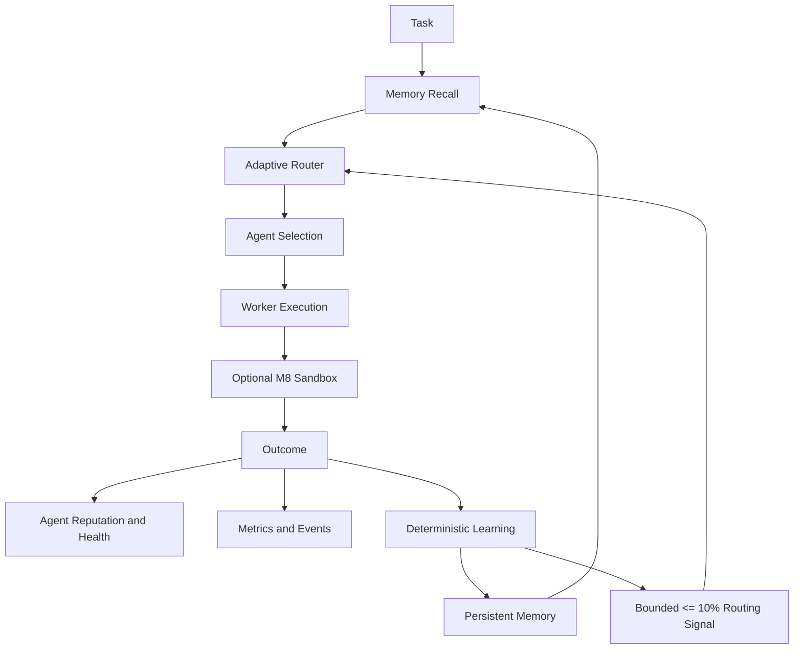

# Helix Architecture

Helix is an independently implemented durable multi-agent orchestration runtime. Its architecture separates planning, routing, execution, policy enforcement, persistence, observability, and learning so that memory can improve future routing without becoming an authority over security or capability constraints.

## Execution and learning loop

## Core boundaries

The planner creates a validated task DAG. The scheduler manages leases and restart recovery. The registry owns current agent health and reputation. The router combines capability, availability, health, reputation, cost, latency, exploration, and an optional bounded learning bonus. When a fully compatible candidate exists, incompatible candidates are excluded before scoring. A learned memory signal therefore cannot override a required capability mismatch.

The policy engine remains default-deny and governs tool, plugin, MCP, and approval boundaries. The M8 sandbox is optional and preserves the existing runtime behavior when disabled. Local execution uses explicit argv, path validation, environment filtering, timeout, and process-group cleanup. Docker execution adds read-only root, non-root execution, dropped capabilities, no-new-privileges, resource limits, workspace-only writable storage, and network disabled by default.

## Persistent memory

`MemoryStore` is a local-first durable JSONL store. It preserves the previous `MemoryRecord` API and adds typed `MemoryEntry` records with strict namespaces, metadata, confidence, tags, provenance, and access policies. `MemoryStore` serializes writes in-process and replays append-only upsert/delete records on restart. The public abstraction is intentionally independent of the backend so SQLite, pgvector, Qdrant, Chroma, Neo4j, or other adapters can be introduced later.

Hybrid search is transparent and configurable. It combines keyword matching, a deterministic local embedding abstraction, recency decay, namespace relevance, confidence, and provenance. The deterministic embedding provider is a stable test/local adapter and makes no claim to be a production semantic model.

## Access and provenance

Namespaces are `global`, `agent:<agentId>`, `swarm:<swarmId>`, `task:<taskId>`, and `session:<sessionId>`. Reads are filtered through subject, owner, visibility, swarm membership, task ownership, and explicit privileged context. Every learned entry has source type, source identifier, timestamp, confidence, and relevant task/execution/agent/swarm identifiers.

Memory is untrusted data. Helix never executes memory contents as code or blindly follows instructions stored in memory. Outcome and sandbox persistence passes through a secret-safe sanitization layer, and duplicate outcome keys prevent replayed learning events from multiplying evidence.

## Learning integration

`PersistentLearningEngine` records successful solutions, routing hints, private agent experience, and failed patterns. It exposes recall, routing hints, execution hints, agent experience, success/failure recording, and bounded routing scores. Failure signals require a configurable repeated-failure threshold and confidence threshold before a temporary negative preference is returned. Half-life decay changes influence over time without deleting memories.

## External surfaces

The versioned API exposes memory CRUD/search and learning hint, experience, and outcome endpoints. The CLI exposes memory search/list/inspect/stats and learning agent/hints commands. The MCP package registers governed memory and learning tools with explicit schemas and `memory:read` permission. Existing API, CLI, provider, plugin, RBAC, federation, knowledge graph, workflow, swarm, and sandbox surfaces remain available.

See [`docs/milestone-9-memory-learning.md`](docs/milestone-9-memory-learning.md) for the detailed M9 design, security review, benchmark method, and limitations. See [`docs/architecture.mmd`](docs/architecture.mmd) for the full Mermaid system diagram.
