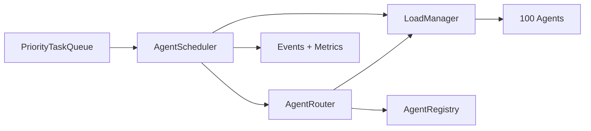

# Milestone 2 — 100-Agent Scheduler, Adaptive Routing & Capacity

Milestone 2 turns the 100-agent registry into an active scheduling plane. It is intentionally provider-neutral: simulation and scheduling work without an LLM runtime.

## Architecture



### Task lifecycle

`pending → assigned → running → completed`

Failures follow `running → pending` while retry budget remains, otherwise `failed`.
Reservation expiry and unhealthy/offline agents trigger requeue/rebalance.

## Routing score

The default `AdaptiveRoutingStrategy` rejects agents missing any required capability. Eligible agents are ranked using:

- capability match: 45%
- available capacity: 20%
- health/success: 15%
- reputation: 15%
- specialization bonus: 5%

The strategy is injectable, so future learning-based or topology-aware strategies can replace it without changing the scheduler.

## Capacity and locking

`LoadManager` tracks `maxConcurrentTasks`, current load, soft limits, and temporary reservations. Assignment is synchronous and reservation-backed, so a single scheduler process cannot assign the same task twice. Reservations expire and are recovered on the next tick.

## Observability

`AgentScheduler.metrics()` exposes waiting tasks, average queue wait, aggregate utilization, throughput, completed/failed counts, and active assignments. Event hooks include `task.assigned`, `task.started`, `task.completed`, `task.failed`, `task.requeued`, `agent.overloaded`, and `agent.rebalanced`.

## Simulation

Run the TypeScript example after compilation:

```bash
pnpm exec tsc -p tsconfig.json
node dist/examples/aetherflow-scheduler-demo.js
```

The example seeds 100 agents, generates 120 synthetic tasks, schedules them by capability/priority/load, and completes them locally without model calls.

## Future work

- distributed / multi-node queue and leases
- hierarchical and mesh schedulers
- persistent reservations
- learning-based routing weights
- per-provider cost/latency signals
- weighted capacity units instead of one task = one unit
- topology-aware locality and anti-drift constraints
- durable event persistence
